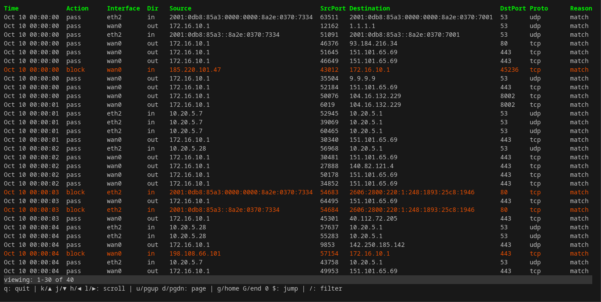

# opnsense-filterlog

- [Overview](#overview)
- [Installation](#installation)
- [Usage](#usage)
  - [CLI](#cli)
  - [TUI](#tui)
  - [Filter](#filter)
- [Contributing](#contributing)
- [Copyright](#copyright)

## Overview

`opnsense-filterlog` is a terminal-based viewer for [OPNsense](https://opnsense.org) firewall logs. Think of it as `less` with powerful filtering capabilities specifically designed for firewall logs. It's a self-contained binary that reads logs line by line without loading the entire log into memory, allowing you to view and analyze large logs directly on low-spec devices such as your firewall appliance.

Main features include:

- Interactive TUI with familiar pager-style navigation.
- `tcpdump`-like filter syntax with field-specific search, logical operators and grouping.
- No external dependencies or runtime requirements.



## Installation

You can download a pre-built binary from the [releases page](https://gitlab.com/allddd/opnsense-filterlog/-/releases) along with its PGP-signed SHA256 checksum ([PGP key](https://gitlab.com/allddd.gpg)).

All releases are reproducible, which means you can build the binary yourself and verify it matches the official release.

```sh
git clone https://gitlab.com/allddd/opnsense-filterlog.git -b <version_you_want_to_reproduce>
cd ./opnsense-filterlog
make build-release
```

Keep in mind that you may need to use the same Go version specified in the [`go.mod`](./go.mod) file of that release to reproduce the binary.

## Usage

### CLI

You can view the default log file (`/var/log/filter/latest.log`) using:

```sh
opnsense-filterlog
```

Alternatively, view specific log file:

```sh
opnsense-filterlog /path/to/filter.log
```

To see all options, display help using:

```sh
opnsense-filterlog -h
```

### TUI

Once inside the TUI, you can navigate using:

- **`j`** or **`↓`** / **`d`** or **`PgDn`** - Scroll down (line / page)
- **`k`** or **`↑`** / **`u`** or **`PgUp`** - Scroll up (line / page)
- **`G`** or **`End`** - Jump to bottom
- **`g`** or **`Home`** - Jump to top
- **`/`** - Enter filter/search mode
- **`q`** or **`Ctrl+C`** - Quit

### Filter

You can filter by specific fields or search across all fields.

#### Simple search

Type a value without a field to search across all fields:

```
192.168
block
tcp
```

#### Field-specific filters

Filter by specific fields using `field value` syntax.

Available fields:

| Field | Aliases | Description |
|-------|---------|-------------|
| `source` | `src` | Source IP address |
| `destination` | `dst`, `dest` | Destination IP address |
| `port` | - | Either source or destination port |
| `srcport` | `sport` | Source port |
| `dstport` | `dport` | Destination port |
| `protocol` | `proto` | Protocol (tcp, udp, icmp, etc.) |
| `action` | - | Action (block, pass, etc.) |
| `interface` | `iface` | Network interface |
| `reason` | - | Reason (match, fragment, etc.) |
| `direction` | `dir` | Direction (in, out, in/out) |

Examples:

```
src 192.168.1.1
dst 10.0.0.1
action block
proto tcp
port 443
iface eth0
```

#### Logical operators

Combine filters with logical operators:

**AND** (`and` or `&&`) - Both conditions must match:

```
src 192.168.1.1 and action block
proto tcp && port 443
```

**OR** (`or` or `||`) - Either condition must match:

```
src 192.168.1.1 or src 192.168.1.2
port 80 || port 443
```

**NOT** (`not` or `!`) - Inverts the condition:

```
not action block
! src 192.168.1.1
```

#### Grouping with parentheses

Use parentheses to control evaluation order:

```
(src 192.168.1.1 or src 192.168.1.2) and action block
proto tcp and (port 80 or port 443)
not (action pass and proto udp)
```

## Contributing

Contributions are welcome! Feel free to report bugs and submit patches.

## Copyright

This project is licensed under the BSD 2-Clause License. See [LICENSE](./LICENSE) for more details.
