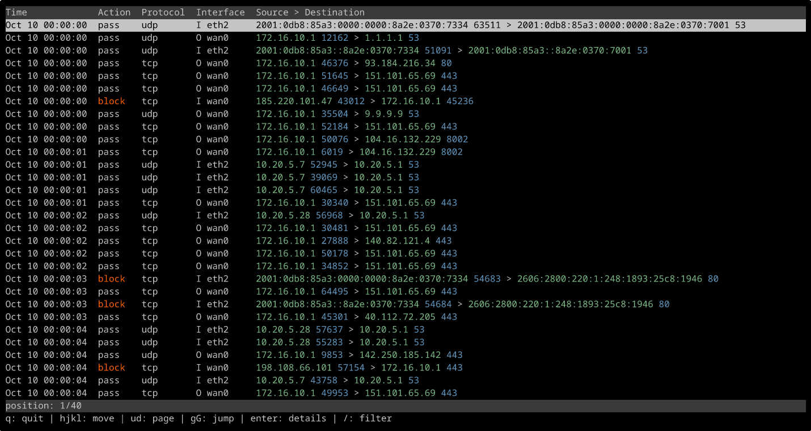

# opnsense-filterlog

`opnsense-filterlog` is a command-line tool and terminal-based viewer for analyzing [OPNsense](https://opnsense.org) firewall logs. It can be used either as an interactive TUI or to output log entries in JSON format for automation, etc. Both CLI and TUI support filtering using a `tcpdump`-like syntax with field- and time-based filters, logical operators, and grouping.



## Installation

`opnsense-filterlog` is available in the [main OPNsense repo](https://pkg.opnsense.org) as a binary package and can be [installed with `pkg`](https://docs.opnsense.org/manual/software_included.html#packages-pkg):

```sh
pkg install opnsense-filterlog
```

Alternatively, you can download a pre-built binary from the [releases page](https://gitlab.com/allddd/opnsense-filterlog/-/releases/permalink/latest) along with its PGP-signed SHA256 checksum ([PGP key](https://keys.openpgp.org/vks/v1/by-fingerprint/2CBB98AE4BB3CAD7D686A2F7150B9C8CC8D36EAC)). 

All releases are reproducible, meaning you can compile from source via the [OPNsense ports tree](https://docs.opnsense.org/manual/software_included.html#the-ports-tree) or the [`Makefile`](./Makefile) and verify the binary matches.

## Usage

See the man page after installing the package:

```sh
man opnsense-filterlog
```

## Contributing

### Questions

Before asking a question, please read the [documentation](#usage) and search for [existing issues](https://gitlab.com/allddd/opnsense-filterlog/-/work_items). If those don't answer your question, [open an issue](https://gitlab.com/allddd/opnsense-filterlog/-/work_items/new).

### Feedback

Before reporting a bug or requesting a feature, make sure you're using the [latest version](https://gitlab.com/allddd/opnsense-filterlog/-/releases/permalink/latest) and have searched [existing issues](https://gitlab.com/allddd/opnsense-filterlog/-/work_items). After confirming it hasn't been fixed/reported/requested, [open an issue](https://gitlab.com/allddd/opnsense-filterlog/-/work_items/new) that includes as much detail as possible (for bugs: expected versus actual behavior, steps to reproduce, environment details, error messages, anonymized log files; for features: description, use cases, etc.).

### Code

Before opening a merge request, please [open an issue](https://gitlab.com/allddd/opnsense-filterlog/-/work_items/new) to discuss the change you want to make.

Commit messages must follow the [Conventional Commits](https://www.conventionalcommits.org/en/v1.0.0/) specification (see `git log` for examples). Commits that change what users see or how things behave and should show up in the release notes need a [trailer](https://docs.gitlab.com/user/project/changelogs/#add-a-trailer-to-a-git-commit).

Before submitting a merge request, make sure `make test` passes, `make lint` doesn’t complain, new features have tests, and documentation is updated.

## Copyright

This project is licensed under the BSD 2-Clause License. See [LICENSE](./LICENSE) for more details.
