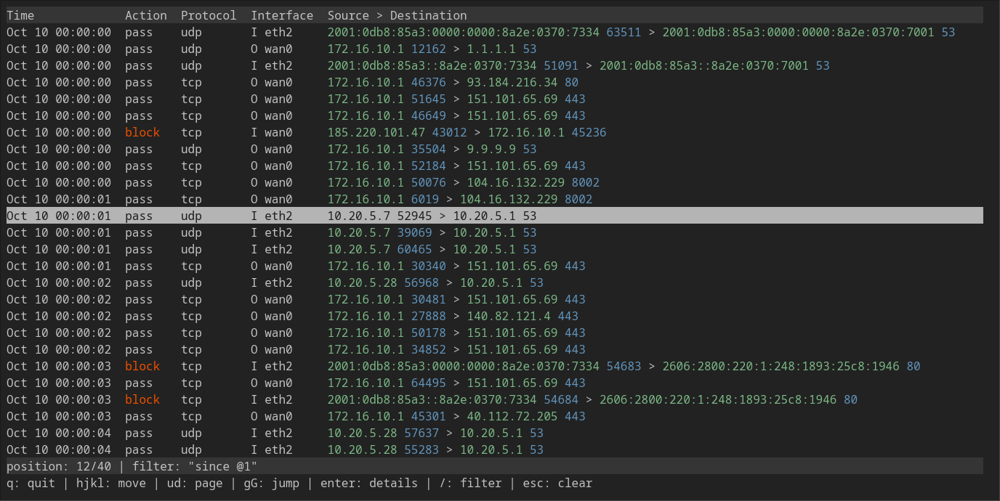
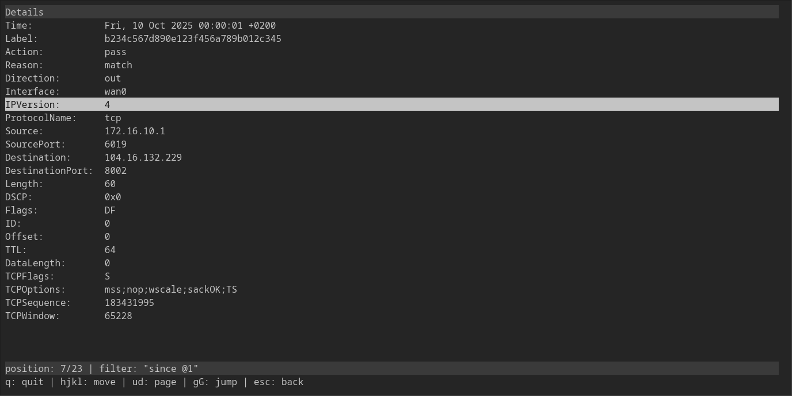

# opnsense-filterlog

- [Overview](#overview)
- [Installation](#installation)
  - [Binary](#binary)
  - [Source](#source)
- [Usage](#usage)
  - [CLI](#cli)
  - [TUI](#tui)
  - [Filter](#filter)
- [Contributing](#contributing)
  - [Questions](#questions)
  - [Feedback](#feedback)
  - [Code](#code)
- [Copyright](#copyright)

## Overview

`opnsense-filterlog` is a terminal-based viewer for [OPNsense](https://opnsense.org) firewall logs. It works similarly to a pager like `less`, but with [filtering/searching capabilities](#filter) (similar to `tcpdump`) built specifically for firewall logs.





## Installation

### Binary

`opnsense-filterlog` is available in the [main OPNsense repo](https://pkg.opnsense.org) as a binary package and can be [installed with `pkg`](https://docs.opnsense.org/manual/software_included.html#packages-pkg):

```sh
pkg install opnsense-filterlog
```

Alternatively, you can download a pre-built binary from the [releases page](https://gitlab.com/allddd/opnsense-filterlog/-/releases/permalink/latest) along with its PGP-signed SHA256 checksum ([PGP key](https://gitlab.com/allddd.gpg)). 

All releases are reproducible, meaning you can compile the binary yourself and verify it matches the release binary.

### Source

Clone the repo (replace `<version>` with the actual version, e.g. `v0.9.0`):

```sh
git clone https://gitlab.com/allddd/opnsense-filterlog.git -b <version>
```

Compile the binary:

```sh
cd ./opnsense-filterlog
make
```

Alternatively, you can compile and install from the [OPNsense ports tree](https://docs.opnsense.org/manual/software_included.html#the-ports-tree).

## Usage

### CLI

You can view the default log file (`/var/log/filter/latest.log`) using:

```sh
opnsense-filterlog
```

Alternatively, view a specific log file using:

```sh
opnsense-filterlog /path/to/filter.log
```

You can also display entries in JSON format (with optional filtering):

```sh
opnsense-filterlog -j
opnsense-filterlog -j -f 'proto tcp && port 443' /path/to/filter.log
```

To see all options, display help using:

```sh
opnsense-filterlog -h
```

### TUI

You can interact with the TUI using:

- **`k`** or **`▲`** / **`g`** or **`Home`** - Scroll/jump up
- **`j`** or **`▼`** / **`G`** or **`End`** - Scroll/jump down
- **`h`** or **`◄`** - Scroll left
- **`l`** or **`►`** - Scroll right
- **`u`** or **`PgUp`** - Page up
- **`d`** or **`PgDn`** - Page down
- **`Enter`** - View details
- **`/`** - Enter filter mode
- **`q`** - Quit

### Filter

#### Simple search

Type a value without a field name to search across all fields:

```
192.168
block
tcp
```

#### Field-based filtering

Use the `field value` syntax to target specific fields:

```
action block
dst 10.0.0.1
iface eth0
ip 4
label 02f4bab031b57d1e30553ce08e0ec131
port 443
proto tcp
src 192.168.1.1
```

Fields:

| Field | Aliases | Description |
|-------|---------|-------------|
| `action` | - | Action (block, pass, etc.) |
| `destination` | `dst`, `dest` | Destination IP address |
| `direction` | `dir` | Direction (in, out, etc.) |
| `dstport` | `dport` | Destination port |
| `host` | - | Either source or destination IP address |
| `interface` | `iface` | Network interface |
| `ipversion` | `ip`, `ipver` | IP version (4 or 6) |
| `label` | - | Rule label |
| `port` | - | Either source or destination port |
| `protocol` | `proto` | Protocol (tcp, udp, icmp, etc.) |
| `reason` | - | Reason (match, fragment, etc.) |
| `source` | `src` | Source IP address |
| `srcport` | `sport` | Source port |

#### Time-based filtering

Use `since` or `until` followed by a timestamp to filter entries by time:

```
since -30min
since -1h
since -2h and until -1h
since yesterday
until 14:00:00
since 14:00 and until 15:16:17
since 2009-11-10
since 2009-11-10T23:00:00Z
```

Timestamps are parsed using [go-systemd-time](https://gitlab.com/allddd/go-systemd-time), see [documentation](https://pkg.go.dev/gitlab.com/allddd/go-systemd-time#ParseTimestamp) for all supported timestamp formats. Note that the filter parser uses space as delimiter, so only timestamps without spaces are supported (e.g. use `2009-11-10T23:00:00` instead of `2009-11-10 23:00:00`).

#### Logical operators

Combine filters with logical operators:

**AND** (`and` or `&&`) - Both conditions must match:

```
src 192.168.1.1 and action block
proto tcp && port 443
```

**OR** (`or` or `||`) - Either condition must match:

```
src 192.168.1.1 or src 192.168.1.2
port 80 || port 443
```

**NOT** (`not` or `!`) - Inverts the condition:

```
not action block
! src 192.168.1.1
```

#### Grouping

Use parentheses to group filters and control evaluation order:

```
(src 192.168.1.1 or src 192.168.1.2) and action block
proto tcp and (port 80 or port 443)
not (action pass and proto udp)
```

## Contributing

### Questions

Before asking a question, please read the [documentation](https://gitlab.com/allddd/opnsense-filterlog#opnsense-filterlog) and search for [existing issues](https://gitlab.com/allddd/opnsense-filterlog/-/work_items). If those don't answer your question, [open an issue](https://gitlab.com/allddd/opnsense-filterlog/-/work_items/new).

### Feedback

Before reporting a bug or requesting a feature, make sure you're using the [latest version](https://gitlab.com/allddd/opnsense-filterlog/-/releases/permalink/latest) and have searched [existing issues](https://gitlab.com/allddd/opnsense-filterlog/-/work_items). After confirming it hasn't been fixed/reported/requested, [open an issue](https://gitlab.com/allddd/opnsense-filterlog/-/work_items/new) that includes as much detail as possible (for bugs: expected versus actual behavior, steps to reproduce, environment details, error messages, anonymized log files; for features: description, use cases, etc.).

### Code

Before opening a merge request, please [open an issue](https://gitlab.com/allddd/opnsense-filterlog/-/work_items/new) to discuss the change you want to make.

Commit messages must follow the [Conventional Commits](https://www.conventionalcommits.org/en/v1.0.0/) specification (see `git log` for examples). Commits that change what users see or how things behave and should show up in the release notes need a [trailer](https://docs.gitlab.com/user/project/changelogs/#add-a-trailer-to-a-git-commit).

Before submitting a merge request, make sure `make test` passes, `make lint` doesn’t complain, new features have tests, and documentation is updated.

## Copyright

This project is licensed under the BSD 2-Clause License. See [LICENSE](./LICENSE) for more details.
